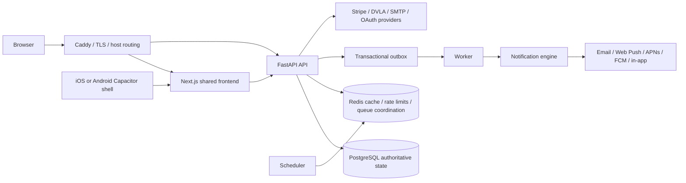
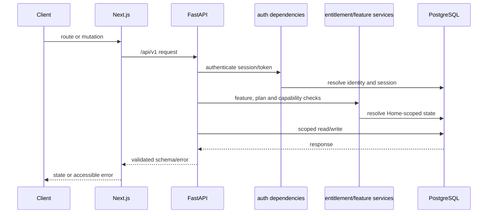
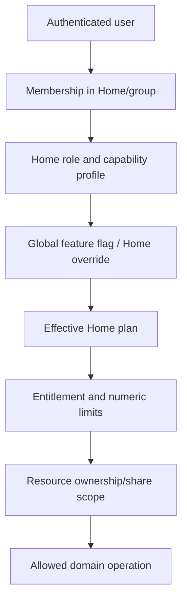
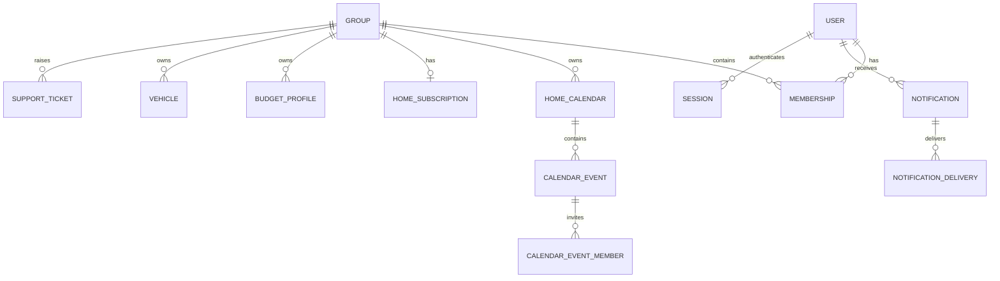
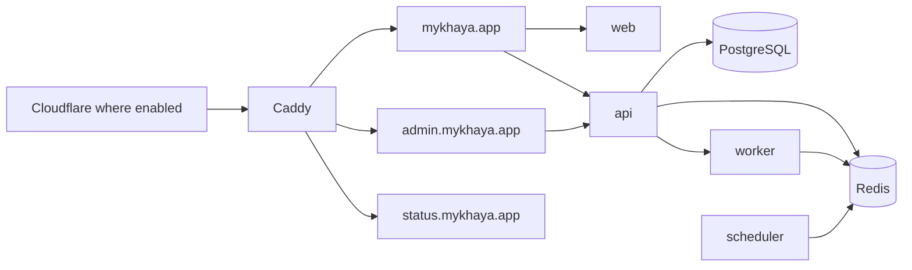

# MyKhaya Functional Specification and Architectural Design

**Document status:** Repository-verified baseline  
**Document version:** 1.0  
**Generated:** 3 October 2026  
**Repository revision reviewed:** `a80ff1486b2a6164f2ac1eff79d9c0928598db17`  
**Evidence rule:** Implementation is treated as current behaviour when it differs from planning documentation. “Not determinable from current repository evidence” is used where evidence is insufficient.

## Executive summary

MyKhaya is a modular-monolith household coordination product. Its primary tenant is a Home (the implementation term is `Group`). The product has one shared consumer web frontend in `apps/web`, a FastAPI API in `apps/api`, PostgreSQL as the authoritative store, Redis for coordination and worker infrastructure, and separate thin Capacitor iOS and Android shells. The Platform Control Centre (PCC) is a separate desktop-first management plane on `admin.mykhaya.app`, with separate administrator identities, sessions, cookies, permissions and audit records.

The system is deliberately not a set of microservices. Web, API, worker and scheduler processes use the same domain model and deployment images. Caddy is the reverse proxy. Production domains are separated into the public/consumer origin, the PCC origin and the public-status origin. Feature availability is resolved through separate layers: global feature flags, commercial entitlement, Home enablement and member capability. Household and platform authorization are never interchangeable.

The current repository contains implemented functionality for identity, Homes and memberships, invitations and join requests, Calendar, calendar sharing, birthdays and holiday highlights, Nudges, Lists, Wishlists, Meals, Budget, Driveway, notifications, support, legal/privacy, billing, PCC operations, incidents, usage and diagnostics. Some product documentation describes phases or future capabilities; those are marked below and are not presented as shipped behaviour.

## 1. Product definition and boundaries

### 1.1 Product and users

MyKhaya helps people coordinate a Home: events, reminders, routines, lists, meals, wishlists, budgets, vehicles, support and household notifications. A Home can contain adults, managed child profiles and shared/external participants where the relevant feature permits it. A user may belong to more than one Home.

The main authority types are:

- **Home Admin:** full household administration profile, subject to server-side capability checks. The final active Home Admin cannot be demoted or removed.
- **Partner:** ordinary household collaboration; not implicitly a Home administrator.
- **Child:** a managed profile with age-band, guardian and restrictive permission controls. A child is not an adult login by default.
- **Extended Family/Friend:** relationship labels are descriptive; access is granted through capabilities and explicit sharing.
- **Platform Owner/Administrator, Support, Security and Read-only Operators:** independent PCC roles. Home membership does not grant PCC access.

### 1.2 Product surfaces

| Surface | Current role | Evidence |
|---|---|---|
| Consumer application | Home and personal coordination, responsive browser UI and native-shell presentation | `apps/web/app`, `apps/web/components` |
| Public website | Marketing, pricing, signup/login routing, public legal and status surfaces | `apps/web/app/about`, public routes, `docs/product` |
| PCC | Restricted control plane for platform administration and operations | `apps/web/app/control-centre`, `apps/api/mykhaya/routers/platform*.py` |
| API | Authentication, authorization, domain rules, persistence and integrations | `apps/api/mykhaya` |
| Worker/scheduler | Notifications, outbox processing, reminders, summaries, cleanup and reconciliation | `apps/api/mykhaya/worker.py`, `scheduler.py`, `notifications/` |
| Native shells | Thin iOS/Android Capacitor loaders for the live shared frontend and native capabilities | `apps/ios-shell`, `apps/android-shell` |

Consumer mobile/native is fixed, stacked, touch-first and safe-area aware. Browser/tablet/desktop is adaptive and spacious. PCC is desktop-first and is not governed by consumer mobile geometry.

### 1.3 Commercial model

Plans are Home-owned, not user-owned. The repository defines Free and Family plan definitions plus complimentary Family access. Ultimate is used by the product documentation and module controls for premium modules including Budget and Driveway; the authoritative current plan/entitlement mapping must be checked in `mykhaya.entitlements` and is not inferred from pricing copy. Stripe is implemented behind `mykhaya.billing`; Apple and Google providers are reserved but not implemented as entitlement providers.

## 2. Functional module catalogue

### 2.1 Identity, Home and membership

Users have authentication identities, sessions, MFA state, trusted devices and optional external identities. Groups/Homes own memberships, invitations, join codes, join requests and Home-scoped resources. Home creation creates the initial calendar and subscription row. Invitations are hashed and have bounded expiry; join-code lookup and regeneration are separate operations. Home Admins can manage members, avatars, colours and membership lifecycle. Platform operators can move members between Homes through PCC workflows.

Managed children use `ChildProfile` and `GuardianAssignment`, age bands rather than full birth dates, explicit guardian membership and restrictive permissions. Child login can be enabled/revoked separately. Transition, guardian and permission changes are confirmed, reasoned and audited. Child-to-adult authority is not inferred from relationship labels.

Representative API groups: `/groups`, `/invitations`, `/home-join`, `/children`, `/users`, `/features`. Representative models: `User`, `Group`, `Membership`, `Invitation`, `HomeJoinRequest`, `ChildProfile`, `GuardianAssignment`.

### 2.2 Calendar

Calendar supports Home calendars, event labels, event creation/edit/delete, occurrence expansion, recurrence exceptions, event activity, participant attendance, calendar sharing and upcoming/summary views. Personal calendars and calendar entitlements are separately tested. Birthday and holiday highlights are additional date sources. Calendar share permissions and lifecycle states are explicit; shared calendars expose only the approved resource scope.

Representative routes include `/calendar/{home_id}/calendars`, `/events`, `/events/{event_id}`, `/events/{event_id}/attendance`, `/event-labels`, `/calendar-shares` and public share acceptance routes. Main entities are `HomeCalendar`, `CalendarEvent`, `CalendarEventMember`, `CalendarEventException`, `CalendarShare` and `CalendarEventActivity`.

Reminders use the notification architecture and are tested by `test_calendar_reminders.py`, `test_calendar_notifications.py` and `test_calendar_reminder_defaults.py`. The repository contains personal calendar preference work and default reminder behaviour; the exact interaction between a changed personal preference and already-materialized event reminder state must remain an explicit implementation concern rather than being assumed from UI copy.

### 2.3 Nudges

Nudges are a first-class domain covering household routines, standalone reminders and to-dos. Routines have recurrence, scope, members and completion records. Reminders have cadence/repeat and member assignment. To-dos have categories, assignment and completion. Notification modules cover routine occurrences, reminder occurrences, standalone reminders, Daily Briefing and related summaries. Morning Briefing, Daily Summary and Evening Clean-up are operational concepts backed by notification modules and scheduler/worker code; exact delivery depends on preferences, quiet hours, eligibility and configured channels.

### 2.4 Lists and shopping

Lists support templates, sections, items, ordering, completion, list scope and collaboration. API routes cover list templates, list CRUD, sections, item CRUD, reordering and clear-completed. Ownership and visibility are Home-scoped and subject to permissions and plan/module checks. The implementation contains list notification integration; no claim is made that every planned shopping workflow is present beyond the routes and models found in the repository.

### 2.5 Wishlists

Wishlists contain occasions, items, shares, guest sessions and item reservations. Guest links are tokenized and separate from household authentication. Reservation status and actor type are explicit. Privacy is central: reservation information is intentionally hidden from the wishlist owner where required so a gift reservation does not reveal the surprise. Public guest routes must not permit Home enumeration or access outside the shared wishlist scope.

### 2.6 Meals and recipes

Meals and meal-plan entries cover meal types/slots, ingredients, participants and ownership. Recipe import and URL validation are implemented in `recipe_import.py` and `wishlist_link_preview.py`-style bounded external-fetch patterns. Meal images have dedicated processing/storage modules and notification tests cover meal-plan notifications. Calendar integration, if exposed by a particular route, is documented as an integration rather than assumed for every meal record.

### 2.7 Budget

Budget is a premium/Ultimate-oriented module with adult-only and sharing rules. Entities include `BudgetProfile`, `BudgetMonth`, `BudgetCategory`, `BudgetItem`, `BudgetIncomeSource`, period/category/item snapshots, spending entries and partner shares. Periods are not required to be calendar months: a configured start day of 25 creates a period from 25 August through 24 September, followed by 25 September through 24 October. Income is assigned to periods; items can be fixed or variable, have notes and optional `ends_on`; spending entries track paid/not-paid and source.

The API covers settings, categories, items, income sources, periods, copying a period, entries and partner shares. Unconfigured periods and downgrade behaviour are represented by explicit response/entitlement rules. Budget ownership remains Home-scoped and sensitive visibility levels are resolved server-side. Relevant tests include `test_budget_module.py`, `test_budget_cross_user_isolation.py`, `test_budget_fixed_item_lifecycle.py` and `test_budget_rollout.py`.

### 2.8 Driveway

Driveway is a vehicle-management module. Vehicles store ownership and Home visibility plus registration, make, model, year, fuel, transmission, country and VIN fields, with vehicle photos and reminders. UK registration lookup uses the provider layer in `driveway_providers.py`; DVLA status and MOT/tax information are exposed only through bounded provider operations. DVSA support is only described where code exists; no current service-history or insurance feature is claimed.

External provider failures are represented as controlled lookup/provider errors, not authorization bypasses. Registration numbers are sensitive vehicle data and are sent externally only for the lookup path. Provider settings and test-connection controls are PCC responsibilities. Relevant tests include `test_driveway_providers.py`, `test_driveway_dvla_integration.py` and `test_driveway_reminders.py`.

### 2.9 Support Hub

Support includes Contact Support, Report a Bug, diagnostics and support tickets. `SupportTicket`, `SupportTicketMessage`, `SupportTicketAttachment` and `SupportTicketDiagnostic` model the workflow. Messages distinguish requester replies, staff public replies and internal notes. Support notifications use the central notification engine. Diagnostics must be privacy-minimized and access-controlled; the PCC support workflow is separate from household content browsing. Tests: `test_support_tickets.py`, `test_support_notifications.py`.

### 2.10 Notifications

The consumer notification centre is exposed through notification routes and preferences. It is distinct from the notification engine: the centre reads user-visible `Notification` rows, while the engine performs recipient calculation, preference/quiet-hour decisions, channel selection, outbox enqueueing, delivery and audit logging. Native devices, Web Push subscriptions, email, in-app and native push are separate delivery registrations.

### 2.11 Legal, privacy and retention

Legal documents have catalogue, version, status, audience, publication and acceptance context. Acceptance records are immutable and include platform/context. Legal gates affect browser/native bootstrap behaviour. Privacy requests, subprocessors, retention lifecycle and Home/account deletion are represented in the API and models. Test mode exists for legal/compliance flows; it must not be treated as production compliance evidence.

### 2.12 Plan and billing

`HomeSubscription` is the source row for effective plan resolution. `effective_plan()` fails safe to Free for missing/unknown/lapsed state; downgrade never deletes Home data. Complimentary grants are PCC-only, reasoned, optionally expiring and audited. Stripe Checkout, Customer Portal, webhook validation, reconciliation and billing diagnostics are implemented behind `mykhaya.billing`. Provider-neutral entitlement resolution remains independent of Stripe. Apple/Google billing is planned/reserved, not an implemented consumer billing path.

## 3. Consumer application information architecture

The App Router contains Home, Calendar, Lists, Wish Lists, Meal Plans, Driveway, Budget-related settings, Settings, People, Help & Support, Legal, Plan/Billing and onboarding/auth routes. Main navigation and the More surface are conditional on role, entitlement, feature state and platform. `app-shell`, `bottom-nav`, `desktop-nav`, `auth-provider`, native runtime helpers and design-token CSS provide the shared presentation contract. PCC routes live under `app/control-centre` and are not reused as consumer routes.

The consumer frontend uses generated/shared API client packages, explicit response models, centralized design tokens and `isNativeShell()`/`nativePlatform()` for genuine native behaviour. Browser secrets are not stored in localStorage. Loading, empty, success and failure states are implemented at page/component level where tests cover them.

## 4. Platform Control Centre

The PCC is a separate management plane at `admin.mykhaya.app`, backed by `/api/v1/platform`. It uses platform administrator identities, `mk_admin_*` cookies, platform roles and separate sessions. Household Owner/Administrator roles do not grant PCC access. The API deliberately exposes operational metadata rather than calendar, list, note, meal, child, location or uploaded content.

Implemented PCC areas include users, Homes, member movement, lifecycle archive/delete/suspend/session revocation, complimentary subscription control, plans/subscriptions, modules and feature overrides, notification templates/channels, communications timeline/diagnostics, SMTP, Web Push/VAPID, Stripe Payments configuration, platform settings, authentication/security health, audits, legal documents/acceptances, privacy requests, retention, support, incidents, jobs, health, usage and status. Sensitive writes require role authorization, recent authentication, explicit confirmation/reason and immutable administrative audit events. General impersonation/content browsing is not implemented.

## 5. Logical architecture



API and web processes are stateless. PostgreSQL is stateful and authoritative. Redis is not the system of record. Worker and scheduler processes are separately deployable roles but share the modular-monolith codebase.

### 5.1 Request and authorization flow



Browser sessions use secure cookies and CSRF protection. Native shells use bearer session tokens stored through secure native storage. Native app lock/biometric state is a local re-entry control, not a replacement for server authentication.

### 5.2 Home isolation and entitlement resolution



The Home/group is the tenant boundary. Queries must derive an authorized Home context and use Home-scoped access. Cross-Home isolation is backed by membership checks, central permission services, scoped repositories/queries, database constraints and cross-tenant tests. External shares are a separate, narrowly-scoped trust boundary.

## 6. Authentication and security

Browser authentication includes password login, external providers where configured, passkeys/WebAuthn, sessions, MFA/TOTP, email MFA, trusted devices, password reset and legal gates. `consumer_mfa.py`, `browser_preauth.py`, `auth.py`, `security.py` and related tests are the main implementation evidence. Sessions are revocable and security-sensitive flows require recent authentication.

Native authentication uses bearer session tokens and secure storage/Keychain/Keystore adapters in `packages/api-client` and `apps/web/components/keychain-native-session-store.ts`. The iOS and Android ADRs establish a thin shell loading the live frontend with explicit single-host navigation, cleartext disabled and no bundled production UI. Native biometric quick sign-in and app relock are implemented in web/native adapters; FCM, Android biometrics, Android App Links and Play Billing are explicitly later work in ADR 0014.

Security controls include secure cookie configuration, CSRF, explicit CORS, trusted-proxy-aware client IP resolution, rate limiting, security headers/CSP, bounded request/file/image resources, password hashing, encrypted stored integration secrets, webhook signature validation, audit logging, tenant isolation and structured non-sensitive errors. Platform administration has separate network/host gates and role checks. The stated assurance target is OWASP ASVS Level 2 and relevant NCSC guidance; this is not a certification claim.

Known security concerns are tracked rather than hidden: PCC production administration still requires completion of the approved MFA/WebAuthn ceremony; some generic PCC settings are explicitly marked `not_enforced`; the public status service initially shares the application stack; and dependency, deployment and real-device verification remain environment-dependent. A complete compliance certification is not determinable from repository evidence.

## 7. Data architecture and migrations

Major model domains are identity/authentication; Home/membership; Calendar; Budget; notifications/Nudges; Lists; Wishlists; Meals; Driveway; legal/privacy; billing; support; PCC operations; audit and outbox. Significant entities are listed throughout this document and defined in `apps/api/mykhaya/models.py`.



Alembic manages migrations under `apps/api/migrations/versions`. Naming and revision chains are integrity-tested. Additive, backwards-compatible rollout is the expected pattern; production data changes require migrations and rollback awareness. Exact retention periods are domain-specific and must not be generalized from one 90-day incident/history policy.

## 8. API architecture

The API is FastAPI with versioned `/api/v1` routes, Pydantic schemas, SQLAlchemy 2 async persistence and reusable dependencies. Domains have routers for auth, groups, invitations, home join, children, calendar, calendar sharing/highlights, routines, reminders, todos, lists, wishlists, meals, budget, driveway, billing, notifications, support, legal, usage, status, health and PCC. Public/anonymous surfaces include health/version, legal document reads, public configuration, public status and explicitly tokenized share/guest routes.

API responses use explicit schemas; pagination and bounded ranges are used where lists can grow. Errors are structured and must not expose SQL, stack traces or configuration. Idempotency and replay protection are used for webhook/outbox/notification-sensitive workflows. Native and browser clients share API contracts through `packages/api-client` and `packages/shared-types`, with some schema duplication remaining between Python and TypeScript.

## 9. Notification and background architecture

All user-facing communications originate through `notify()` in `apps/api/mykhaya/notifications/engine.py`. Modules must not send email, push or in-app notifications directly. The engine calculates recipients, applies visibility, mandatory-vs-optional policy, preferences and quiet hours, writes notifications/deliveries and emits work for the worker. Delivery handlers own SMTP, Web Push, APNs/FCM/native delivery. Templates and PCC overrides are managed through notification-template models and routes.

```mermaid
flowchart LR
  T[Domain event or scheduler] --> N[notify()]
  N --> V[recipient visibility + eligibility]
  V --> P[user preferences + quiet hours]
  P --> O[Outbox / durable job]
  O --> W[Worker]
  W --> D[NotificationDelivery]
  D --> CH[In-app / email / Web Push / APNs / FCM]
  D --> A[delivery audit and retry state]
```

The scheduler drives recurring reminders, calendar notifications, Daily Briefing/Summary, routine/reminder occurrences, retention, billing reconciliation and operational jobs. Worker job records, outbox events, retry state and idempotency keys make restart/retry behaviour observable. Exact cron frequencies are not uniformly documented; where not visible, frequency is **not determinable from current repository evidence**.

## 10. Billing and external integrations

Stripe is the implemented paid provider boundary. Checkout and Customer Portal sessions are created server-side, webhook signatures are validated, Stripe state is reconciled into `HomeSubscription`, and checkout return alone does not grant entitlement. `past_due` remains honored according to current policy; cancellation returns the Home to Free only when the provider says access has ended. Stripe settings have test/live separation, encrypted secrets and PCC test-connection/audit controls.

Integrations catalogue:

| Integration | Flow | Current status and controls |
|---|---|---|
| Stripe | API/webhooks for billing | Implemented provider boundary; idempotent reconciliation and diagnostics |
| DVLA/DVSA-related providers | Registration lookup and vehicle data | Provider abstraction and failure tests; UK-specific path |
| SMTP/email | Worker delivery | PCC-stored encrypted credentials or controlled local environment fallback |
| Web Push | Browser subscription and delivery | VAPID configuration, encrypted private key and rotation consequences |
| APNs/FCM | Native delivery | Native registration/worker code; Android FCM product flow remains incomplete per ADR |
| Apple/Google identity | OAuth/provider health | Configuration and auth-provider paths; secret writes remain deployment-managed |
| Cloudflare/Caddy/NetBird | Edge, TLS, routing, private administration | Deployment/infrastructure controls, not domain data providers |
| Syslog | Operational log forwarding | Redaction and forwarding module; deployment-dependent destination |

## 11. Deployment and scale

Docker Compose is the primary deployment model. Services include Caddy, web, API, PostgreSQL, Redis, worker, scheduler and Mailpit for local development. Only Caddy publishes public host ports in the intended topology. Production uses the same images with environment-specific secrets/configuration; databases and Redis remain internal. Migrations run as an operational deployment concern, with backup/restore and staged upgrade documentation.



The future regional model (Cloudflare → edge VPS → Caddy → regional application nodes, placement directory and mTLS node identity) is an architectural direction, not a fully evidenced current multi-region deployment. Current likely scale strengths are stateless web/API, Home-scoped queries, PostgreSQL indexes, Redis coordination and durable worker separation. Future pressure points are notification fan-out, scheduler partitioning, database growth/partitioning, queue backpressure, cache isolation, connection pools and Home placement. A validated 100,000-Home capacity number is not present.

## 12. Operations, privacy and accessibility

Health has liveness/readiness, build/version and integration status surfaces. PCC exposes health cards, jobs, diagnostics, usage, incidents and audit. Public status contracts are deliberately smaller than internal diagnostics. Incident records have lifecycle, service, update and public/private status concepts; exact retention is domain-specific.

Personal data includes identity, Home membership, child profile data, calendar/list/meal/budget/wishlist data, vehicle data, support content, notification tokens, legal acceptance and operational audit metadata. Sensitive external transmissions are limited to provider operations, email/push delivery, Stripe and explicitly shared resources. Account/Home deletion, retention lifecycle and privacy requests are implemented in dedicated modules; exact deletion order and purge timing must be verified per flow.

Frontend standards require semantic structure, keyboard access, focus handling, contrast, touch targets and responsive behaviour. The repository has accessibility/design tests and shared design tokens. Reduced-motion and every screen-reader outcome are not uniformly evidenced and should not be claimed as complete. Desktop web, mobile web and native shells are supported by implementation; real iOS physical-device and Android emulator verification remain environment-dependent.

## 13. Testing and quality

Backend tests cover authentication, MFA, tenancy, Home controls, calendar, reminders, notifications, billing, budget, Driveway, legal, support, PCC, migration integrity, health and security. Frontend tests use Vitest/Testing Library; critical journeys use Playwright. Shared API client, design tokens, native runtime, native session storage and shell configuration have unit tests. Android Gradle/device execution and physical iOS execution cannot be verified from this repository-only review.

The repository’s definition of done requires work to be secure, tested, documented, observable, reversible and consistent with visual identity. This specification is documentation-only and makes no code or schema changes.

## 14. Known gaps, technical debt and architectural risks

### Functional gaps

- Some product-plan copy describes modules or pricing phases ahead of the implementation; entitlement code is authoritative.
- Android FCM, Android biometrics, App Links, Play Billing and widgets are explicitly future work.
- Public status independence from the main application stack is not complete.
- Some PCC generic settings are displayed but marked `not_enforced`; they must not be treated as live controls.

### Security gaps

- Production PCC WebAuthn/passkey/MFA ceremony is documented as incomplete; password-only production administration is not approved.
- External provider and notification delivery security depends on deployment secrets, host restrictions and operational configuration that cannot be proven from source alone.
- Certification/compliance status is not determinable from repository evidence.

### Architecture debt

- Product and architecture documents span phased states and sometimes describe intended future behaviour alongside current behaviour.
- Python API schemas and TypeScript contracts are shared conceptually but are not fully generated from one canonical schema.
- The regional placement/control-plane design is ahead of the current single-Compose deployment.
- Some business logic remains concentrated in routers despite the service-oriented standard.

### Test and verification gaps

- Full production-like backend tests require the normal environment, including Redis and database services.
- Native device/emulator rendering and store build verification are not available in this repository-only review.
- Complete end-to-end coverage for every module, provider failure mode and retention path is not evidenced.

## 15. Feature traceability matrix

| Domain | Consumer UI | PCC | API/model | Worker/notifications | Plan | Audit/tests |
|---|---|---|---|---|---|---|
| Home/membership | Home, People, onboarding | Users, Homes, movement | groups, invitations, children | invitation/support notifications | Free core | household/security tests |
| Calendar | Calendar, event sheets/settings | module controls | calendar, sharing, highlights | reminders, birthdays, holidays | Free/Family rules | calendar suites |
| Nudges | routines, reminders, todos | communications/config | routines, reminders, todos | briefing/occurrences | feature-gated | nudge suites |
| Lists | Lists and templates | module controls | lists | list notifications | Family/module | list tests |
| Wishlists | Wishlists and guest share | operational/support scope | wishlists, guest sessions | reservation/share notifications | Family/module | wishlist tests |
| Meals | Meal Plans | module controls | meals, recipes, images | meal notifications | module | meal tests |
| Budget | budget screens | entitlement/admin visibility | budget entities/routes | limited scheduled behaviour | Ultimate/premium | budget isolation/lifecycle |
| Driveway | vehicle screens | provider/settings | vehicles, reminders | MOT/tax/manual reminders | Ultimate/premium | provider/reminder tests |
| Billing | settings billing | Payments/subscriptions | billing, Stripe webhooks | reconciliation | Home-owned | billing suites |
| Legal/privacy | legal gate/settings | documents, acceptances, retention | legal/privacy models | retention jobs | global | legal/privacy tests |
| Support/status | Help & Support | tickets, incidents, health | support/status routes | support notifications | global | support/status tests |

## 16. Security-control matrix

| Concern | Control | Enforcement point | Evidence |
|---|---|---|---|
| Authentication | sessions, bearer native tokens, MFA/passkeys | auth dependencies and native store | `auth.py`, `consumer_mfa.py`, API client |
| Tenant isolation | membership + Home-scoped queries | routers/services/repositories/tests | `multi-tenancy.md`, isolation tests |
| Authorization | capabilities, roles, recent auth | dependencies and domain guards | `household_permissions.py`, platform guards |
| Commercial access | central entitlement resolver | API/domain service | `entitlements.py` |
| CSRF/CORS | cookie mutation protection and allowlists | middleware/config | `security.py`, `main.py` |
| Rate limiting | Redis-backed bounded controls | middleware/router dependencies | `rate_limit.py` |
| Webhooks | signature and idempotent state reconciliation | billing webhook router | `billing/webhooks.py`, tests |
| Secrets | encrypted stored integration secrets | crypto/config/PCC | `secrets_crypto.py`, platform settings |
| Audit | household and administrative audit records | domain/PCC mutation paths | `audit.py`, `platform_audit.py` |
| Error safety | structured non-sensitive errors | FastAPI handlers | backend standards and tests |

## 17. Architectural state assessment

### Current architecture

A containerized FastAPI/Next.js modular monolith with PostgreSQL, Redis, worker/scheduler processes, Caddy routing, one shared consumer frontend and thin Capacitor shells. PCC is a separate privileged management plane within the same deployed application stack.

### Architectural strengths

The repository has explicit Home tenancy concepts, central entitlement resolution, separate PCC authority, a single notification engine, provider boundaries for billing and vehicles, durable outbox/worker concepts, structured audit models and substantial regression coverage.

### Important architectural debt

The largest risks are phase/document drift, incomplete PCC MFA ceremony, partial native platform maturity, future-scale work not yet deployed, schema duplication and uneven concentration of business logic across routers and services.

### Security posture

There are meaningful layered controls for authentication, authorization, tenancy, CSRF/CORS, rate limiting, secrets and audit. Remaining risks include deployment configuration, incomplete privileged MFA, provider availability and the inability to infer production operational correctness solely from source.

### Scalability posture

The stateless web/API split and worker separation are sound foundations. The repository does not establish a tested 100,000-Home capacity figure. Scheduler, notification fan-out, PostgreSQL growth, queueing and regional placement need measured engineering before that scale is claimed.

### Mobile maturity

iOS is the more mature documented native shell, using the live shared frontend and secure storage/native capabilities. Android shell structure and configuration exist, but FCM, biometrics, App Links, billing and device verification remain incomplete. Shared business logic is intentionally in the web/API layers.

### Operational maturity

PCC health, jobs, audit, incidents, support, status, billing diagnostics, backup/deployment documentation and notification delivery records provide a meaningful operational foundation. Independent status hosting, full production admin MFA and complete native/device validation remain open.

### Areas still under active development

The repository clearly identifies future work around multi-region placement, Apple/Google billing, Android capabilities, PCC MFA/WebAuthn, public status independence, additional module rollout, stronger generated contracts and broader end-to-end/physical-device validation.

## 18. Evidence and confidence notes

Representative evidence was reviewed in `AGENTS.md`, engineering/frontend/backend/mobile/testing/security standards, design and accessibility guidance, ADRs 0001–0014, architecture documents for authentication, tenancy, entitlements, notifications, deployment, PCC and data model, product plan documents, `apps/api/mykhaya/models.py`, domain routers/services/workers/scheduler, `apps/web`, `packages/api-client`, `apps/ios-shell`, `apps/android-shell`, migrations and tests.

Statements about live infrastructure values, secrets, provider accounts, physical devices, deployment capacity, exact job frequency where not encoded, and certification are **not determinable from current repository evidence**. Planned architecture is labelled as planned or partial and is not included in the current-state claim.
